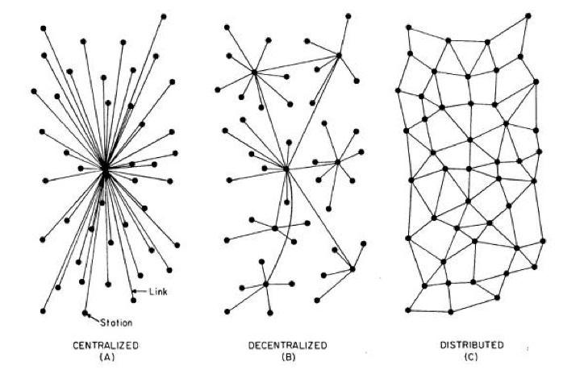

<h1 align="center">Ethereum Example</h1>

## Motivation
After performing [research](https://github.com/idflores/blockchain-example) in Blockchain technology, I discovered major blockchain implementations that needed their own repository to continue performing personal in-depth studies. This repository is purposed as a growing knowledge-base for the Ethereum blockchain and is focused on the technology beyond its CryptoCurrency applications.

## Usage

## "Whitepaper"

### Ethereum Defined
**Ethereum** is an implementation of the BlockChain technology. Unlike its predecessor, Bitcoin, an Ethereum *block*'s *data* property is an accumulator of not only *transactions* but also *messages* and *contracts*.(fix this)

State Transition Machine

#### Smart Contracts and Accounts
An Ethereum **contract**, or colloquially, **Smart Contract**, is a data structure that resides, at a given address, on the Ethereum blockchain and maintains the state and function of specified data. One could simply think of an Ethereum contract similar to a traditional "class" definition. More technically, however, an Ethereum contract is an addressable set of compiled opcodes written in and executable by the [Ethereum Virtual Machine](#the-ethereum-virtual-machine) (EVM) language.

An Ethereum contract is one of the two types of Ethereum accounts; this concept of "accounts" is important since it implies inherent autonomy, whether through automation or human input. Indeed, given a valid invocation, Ethereum contracts are capable of performing automated functions and communication with other contracts and/or *External Accounts*. Additionally, Ethereum contracts are capable of generating new contracts. This ability of function execution, account communication, and contract generation warrant the Ethereum contract's *account* definition.

The other account type is the **External Account** named such because, unlike the contract, External Accounts do not reside on the blockchain. These accounts generally describe a human presence and form the basis which all contract accounts foundationally originate.

#### Transactions and Messages
A **Transaction** is a signed data structure from an *External Account* that both describes and invokes a change of state. The origination is what gives the *transaction* its definition; a transaction may occur from an External Account to another External Account or to a contract but never from a contract. A transaction has the following architecture:
+ Recipient Address
+ Sender Cryptographic Signature
+ Amount of Ether
+ Data (optional)
+ *STARTGAS* -- maximum gas allowance
+ *GASPRICE* -- fee, in Ether, sender is willing to pay miner

A **Message** describes a non-serialized transaction from a contract to either another contract or an External Account. Messages only exist in the Ethereum runtime and cannot originate from External Accounts. The following architecture describes messages:
+ Recipient Address
+ Sender Address
+ Amount of Ether
+ Data (optional)
+ *STARTGAS* -- maximum gas allowance
+ *GASPRICE* -- fee, in Ether, sender is willing to pay miner

It is important to note that the Sender Address for *messages* is implicit. In general, messages are only ever instantiated as a result of a transaction. This is logical to assume since, at its origin, a contract can never execute one of its functions without an invocation which results from a transaction. Additionally, there are two types of transactions -- the first resulting in one or more message calls as just described, and the second resulting in contract creation.

It is also important to note that transactions *broadcast* their existence and activity to the Peer2Peer network and are published to the blockchain. However, a **call** is a simple invocation to a specified contract function on the blockchain whose execution does not broadcast activity to the Peer2Peer network nor is publish to the blockchain.

#### Gas
**Gas** in Ethereum is the cost of execution of a transaction, message or contract function by a miner. It is calculated by quantifying the "computational steps" (i.e. opcode execution by the [EVM](#the-ethereum-virtual-machine)) and their associated cost. The **Gas Cost** is the designated cost for each "computational step" which is usually just 1 Gas; however, more complicated instructions have higher Gas Costs. Additionally, each byte of transaction data has a fee of 5 Gas.

Closely related, **Gas Price** is the amount in *Ether* for each Gas unit and is used to when a user attempts to incentivize a miner to mine his transaction/contract and publish it to the block ([Miners and Mining Incentive](#miners-and-mining-incentive)). It is determined through the basic principles of supply and demand: Ethereum miners have the incentive to keep the Gas Price low to attract more users to the platform thus having more content to mine; users have the incentive to pay a higher Gas Price in order to have their transaction or contract validated and published to the blockchain more quickly.

The primary purpose of Gas is to prevent Denial of Service (DoS) attacks to miner nodes. Consider the consequences of an infinite looping contract function placed on the blockchain. During validation or any execution of this function, a miner would be infinitely incapable of further computation as a result of the infinite loop. Gas and Gas limits effectively make such an attack impossible by both dissuading the attacker by charging for mining resources (computation power, storage, etc.) and automatically halting infinite loop executions when a Gas limit has been reached. Moreover, Gas costs Ether, further discouraging such an attack and preventing an infinite Gas limit allocation by the attacker.

#### Ether
**Ether** is the digital asset of the Ethereum blockchain purposed primarily as a means to pay miner transaction fees. The most basic denomination of *Ether* coin is **Wei**; however, there are multiple measures of the coin the major of such as follows:

| Measure |        Amount in Wei        |Other Names|
|:-------:|:---------------------------:|:---------:|
| 1 Gwei  |1,000,000,000 Wei            | Nanoether |
| 1 Szabo |1,000,000,000,000 Wei        | Microether|
| 1 Finney|1,000,000,000,000,000 Wei    | Milliether|
| 1 Ether |1,000,000,000,000,000,000 Wei|   Ether   |

The *Gwei* denomination is commonly used to describe miner fees. *Szabo* and *Finney* are commonly used to describe wallet balances. *Ether*, of course, is the most well known denomination commonly used in trading.

Unlike Bitcoin, *Ether* has a surprisingly small importance in comparison to other benefits of the Ethereum blockchain. It's existence is purely out of the necessity for miner fees and incentives.

#### Miners and Mining Incentive
fees

### The Ethereum Virtual Machine
*Ethereum Contracts*, as mentioned before, are addressable sets of compiled opcodes. The **Ethereum Virtual Machine** (**EVM**) is an abstract, Turing-Complete computation machine similar to the Java Virtual Machine (JVM) in both purpose and operation. It is meant to provide both a language to interpret contract opcodes and a common environment in which all miner nodes may execute contract implementations.

The following illustration shows the EVM's functional placement in the Ethereum architecture:

#### The Ethereum Client
The Ethereum Virtual Machine is a part of the *Ethereum Client* which is not only responsible for providing the runtime environment for the compiled contracts but is also responsible for Peer2Peer network communication, blockchain management and concensus, account management, etc. Currently, there are 4 official "flavors" of the Ethereum Client maintained by the [Ethereum Foundation](https://www.ethereum.org/foundation):
+ [**Go-Ethereum**](https://github.com/ethereum/go-ethereum) -- a *GoLang* implementation, also known as "**Geth**", geared toward web and ÐApp development and official Ethereum Foundation offerings such as the [Mist](https://github.com/ethereum/mist/releases) wallet; it is the most popular client.
+ [**CPP-Ethereum**](https://github.com/ethereum/cpp-ethereum/) -- a *C++* implementation, also known as "**Eth**", focused specifically on speed for serious mining applications; also serves as the reference client and bundled with the [Mist](https://github.com/ethereum/mist/releases) wallet.
+ [**EthereumJS**](https://ethereumjs.github.io) -- an alternative *JavaScript* implementation meant for web and ÐApp development.
+ [**PyEthApp**](https://github.com/ethereum/pyethapp) -- a *Python* implementation focused on making Ethereum readable for beginners or for those who wish to easily hack at the Ethereum core.

There are other clients for Ruby, Java and Haskell but the most notable and very popular 3rd party implementation is the Rust client maintained by the [ParityTech](http://paritytech.io) team. Each client implementation, both official and 3rd party, apply the protocol from the [Ethereum Yellow Paper](https://ethereum.github.io/yellowpaper/paper.pdf), which defines, in detail, every aspect of the Ethereum blockchain including data structures, message and transaction handling, etc. Incidentally, the Yellow Paper was written by the founder of both Ethereum and the Parity client, Gavin Wood, Ph.D.

#### Web3.js
The *Ethereum Client* is meant to offer a platform for mining, wallet and account management, and contract development. Interfacing with the client on your local node and the Peer2Peer network, however, is handled by the [**web3.js**](https://github.com/ethereum/web3.js/) framework which applies the **[JSON-RPC](https://github.com/ethereum/wiki/wiki/JSON-RPC)** Ethereum protocol. *Web3.js* allows developers to:
+ query the Ethereum Peer2Peer network,
+ *dynamically generate, compile, and publish [*Solidity*](#solidity) contracts,*
+ execute contract functions on the blockchain,
+ etc.

Like the *Ethereum Client*, there are a few implementations of the *web3.js* framework including:
+ [**Web3.js**](https://github.com/ethereum/web3.js) -- the *JavaScript* implementation backed by the [Ethereum Foundation](https://www.ethereum.org/foundation); most popular.
+ [**Web3j**](https://github.com/web3j/web3j) -- a 3rd party *Java* implementation by [Web3j](https://web3j.io/) in London, England.
+ [**Nethereum**](https://github.com/Nethereum/Nethereum) -- a 3rd parth *C#* implementation by [Nethereum](http://www.nethereum.com).
+ [**Ethereum-Ruby**](https://github.com/DigixGlobal/ethereum-ruby) -- a 3rd party *Ruby* implementation by [DigixGlobal](https://digix.global) in Singapore.

#### Solidity
The *Ethereum Virtual Machine* is only a runtime environment for compiled contracts, which necessitates a high-level language to provide and compile readable contract code to EVM opcodes.
The most popular, [**Solidity**](https://github.com/ethereum/solidity/), is a high-level, compiled, Domain Specific Language (DSL), written in C++ and maintained by the [Ethereum Foundation](https://github.com/ethereum) as their primary DSL for contract development. Its compiled by the C++ [`solc`](https://github.com/ethereum/solidity) compiler and was developed to be heavily related to JavaScript and C in structure, keywords, types and style.

More research and reference notes on the Solidity language can be found in [`docs/Solidity.md`](docs/Solidity.md)

##### Other Contract-Oriented DSLs
There are other High-Level DLSs to handle Ethereum contract development. The next most popular is [*Serpent*](https://github.com/ethereum/serpent), also developed in C++ and maintained by the [Ethereum Foundation](https://github.com/ethereum), and as the name suggests, it was designed to be heavily related to Python. The following quote aptly describes *Serpents* usage:
> Being a low-level language, Serpent is NOT RECOMMENDED for building applications unless you really really know what you're doing. The creator recommends Solidity as a default choice, LLL if you want close-to-the-metal optimizations, or Viper if you like its features though it is still experimental.

Another contract-oriented DSL is the *Low-Level Lisp-Like Language* (*LLL*). As described by its name, *LLL* is meant to "feel" like Lisp and be a lower level implementation of Solidity for optimization. *LLL*'s definition,  [parser](https://github.com/ethereum/solidity/tree/develop/liblll) and [compiler](https://github.com/ethereum/solidity/tree/develop/lllc), however, are actually a part of the *Solidity* [repo](https://github.com/ethereum/solidity). This quote aptly describes LLL current purpose and development state:
> LLL was always meant to be very simple and minimalistic; essentially just a tiny wrapper over coding in ASM directly. In my opinion just use serpent; it has direct access to opcodes so it is a superset of LLL but it also has a whole bunch of high-level features as well for when you want them. The downside is that the compiler is more complex and so theoretically might contain more bugs.
-- [Vitalik Buterin](https://ethereum.stackexchange.com/questions/348/is-lll-still-used-as-language)

[*Viper*](https://github.com/ethereum/vyper), is yet another contract-oriented DSL written in entirely in Python. The software is still in alpha by the Ethereum Foundation but looks promising from its [examples](https://github.com/ethereum/vyper/tree/master/examples). An *LLL* [definition](https://github.com/ethereum/vyper/blob/master/viper/compile_lll.py) is also included in the repo allowing for definitions in both C++ and Python.

There are still others including [*Mutan*](https://github.com/obscuren/mutan) which was written in and heavily related to GoLang. *Mutan* was [deprecated](https://forum.ethereum.org/discussion/922/mutan-faq) in March 2015, however, and replaced by *Solidity*.

### The ÐApp
Given this ability to programmatically define the behavior of data through *Smart Contracts*, it is logical to conclude that entire applications can be built on this programmatic framework. Consequently, the development of BlockChain applications has been formalized since Ethereum's inception and are colloquially termed "ÐApps."

A **ÐApp** is a **D**ecentralied **App**lication commonly built on the Ethereum BlockChain. More technically, a **ÐApp** is a collection of related Ethereum contracts that reside on the blockchain and perform various functions, most notably the storage of data. A *ÐApp* is commonly used for some user-based application and is, consequently, accompanied by some "front-end" interface.

While perhaps not beneficial in all cases, this distinctly implies that most modern web applications could be implemented using a *ÐApp*. An excellent example is the [pet shop adoption service](http://truffleframework.com/tutorials/pet-shop) from Truffle Suite. Instead of maintaining a centralized database including information of all pet adoptions, the data is maintained on the blockchain using Ethereum contracts to manage and store adoption transactions. A front-end is easily implemented with *web3.js** and common frameworks like [MeteorJS](https://www.meteor.com); additionally, we gained some clear advantages:
+ Transaction **security** is enforced by blockchain
+ Transactions can take place through **CryptoCurrency**
+ A little more work, and **USD** can still be used for payment, securely
+ decentralized and permanent history of transactions
+ less server/DevOps overhead

#### Centralized, Decentralized & Distributed Modeling
Consider the following illustration:

Source: [What's A ÐApp?](https://www.stateofthedapps.com/whats-a-dapp)

From the above illustration, we can conclude a couple things that are unique to the intent of Ethereum ÐApp design. The most immediate is a decentralized model is a hybrid of the centralized and distributed model. While obvious, it is important to identify this difference since there is a common misconception that the terms decentralized and distributed are synonymous and represent a "server-less" architecture. The exact opposite is true, and, in fact, the decentralized model may still include a client-server-like state.

Consider a practical blockchain example.

## Proof-of-Concept

## Development Environment
+ MacOS High Sierra v10.13.2
  + MacBook Pro 13", Early 2015
  + Intel Core i7 3.1GHz
  + 16GB 1867MHz DDR3
+ Atom v1.23.3 (downloaded)
+ Hyper Terminal v1.4.8 (downloaded)

#### Example Contract
+ [Remix v1.1 build d50dcc4](https://github.com/ethereum/browser-solidity/tree/gh-pages) (offline)
  + Google Chrome v63.0.3239.132 (64-bit)
  + "Environment" setting: *JavaScript VM*
+ [Ethereum Mist Wallet v0.9.3 [Rinkeby]](https://github.com/ethereum/mist/releases/tag/v0.9.3) (downloaded)

#### Example ÐApp

## Disclaimer
This project is meant to be a personal knowledge-base and example of the Ethereum blockchain technology principles. Several features are intentionally missing. While the repository will grow with new research, examples and algorithms, it is never recommended to be used for production.

## Resources
+ [Ethereum Whitepaper](https://github.com/ethereum/wiki/wiki/White-Paper)
+ [Ethereum Yellowpaper](https://ethereum.github.io/yellowpaper/paper.pdf)
+ [Ethereum.org](https://ethereum.org) -- the Ethereum homepage
+ [StateOfTheDapps.com](https://www.stateofthedapps.com) -- a currated list of ÐApps built on Ethereum
+ [Etherscan.io](https://etherscan.io) -- details about block behavior on the Ethereum BlockChain
+ [What's A ÐApp?](https://www.stateofthedapps.com/whats-a-dapp)
+ [Ethereum CLI](https://www.ethereum.org/cli) -- developer Ethereum CLI
+ [Introduction to Smart Contracts](http://solidity.readthedocs.io/en/latest/introduction-to-smart-contracts.html)
+ [Solidity by Example](http://solidity.readthedocs.io/en/latest/solidity-by-example.html)
+ [Solidity](https://github.com/ethereum/solidity) -- the Solidity Github repo
+ [Ethereum Gas Station](https://ethgasstation.info) -- realtime gas prices and calculator from the Peer2Peer blockchain network
+ [Contract Wallets](https://klmoney.wordpress.com/beta7-contract-wallets/) -- a description of the Contract Wallet and its difference from the Account Wallet
+ [StackOverflow: Transaction vs Call](https://ethereum.stackexchange.com/questions/765/what-is-the-difference-between-a-transaction-and-a-call)
+ [Effect of Ethereum Gas Price](https://www.coindesk.com/ethereums-double-edged-sword-will-rising-price-hurt-users/) -- note the section "Miner Pressure"
+ [LLL Docs](http://lll-docs.readthedocs.io/en/latest/lll_introduction.html)
