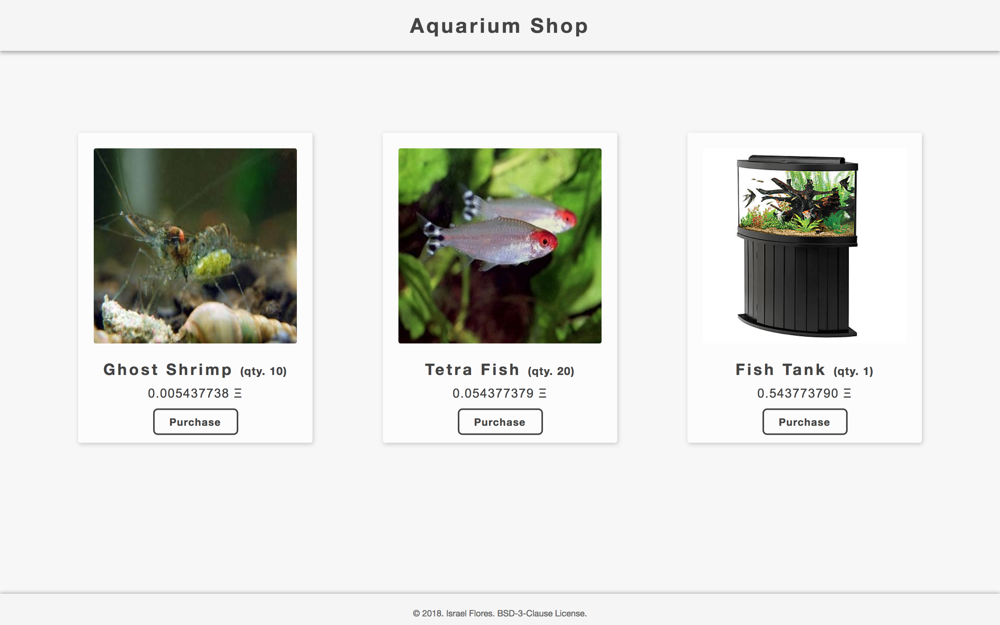

<h1 align=center>Aquarium Shop Decentralized Application</h1>



## Usage
#### Prerequisites
+ Install the [Ganache Desktop Client](http://truffleframework.com/ganache/) and have it *running*
  + Make sure Ganache's RPC server is set to `http://127.0.0.1:7545`
  + Make sure you are using the following mnemonics to ensure your address hash's are the same:
  `candy maple cake sugar pudding cream honey rich smooth crumble sweet treat`
+ Make sure you have [Node v8.9.4 "Carbon"](https://nodejs.org/en/download/) installed
+ Make sure you have [NPM v5.6.0](https://www.npmjs.com/get-npm) installed

#### Procedure
Clone the main repository and run the server by doing the following:
```bash
cd ethereum-example/dapps/aquarium-shop
sh run
```
The `run` script will set up your environment, install any necessary dependencies and run the server.

Take a look at the demonstration running on [localhost:8080](localhost:8080). You should see the example illustrated in the section [Example DApp - Aquarium Shop](#example-dapp---aquarium-shop).

#### Clean Up
Because some packages are necessary to install on NPM's global scope, a `clean` script has been included to remove them should you wish to remove the demonstration after viewing. Perform the following:
```bash
cd ethereum-example/dapps/aquarium-shop
sh clean
```

*WARNING*: This will uninstall `webpack` from the NPM's global scope. You will need to install `webpack` again if you use this script and wish to keep `webpack`.
